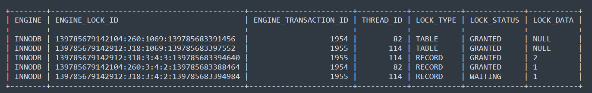
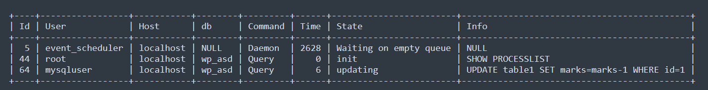

### 1. How could you potentially investigate the reasons of such alert appearance?

Firstly, I would execute the following command in MySQL:

>SHOW ENGINE INNODB STATUS\G;

The output will be similar to the one provided in the SHOW_ENGINE_INNODB_STATUS.md document (logs for the deadlock I've created by following the steps from this thread: https://stackoverflow.com/questions/31552766/how-to-cause-deadlock-on-mysql).

A deadlock is a situation in which multiple transactions are unable to proceed because each transaction holds a lock that is needed by another one. Since all transactions involved are waiting for the same resource to become available, none of them can release the lock they hold.

We can check for existing deadlocks by running this query:

>mysql> select * FROM performance_schema.data_locks;

Alternatively, you can use this query (since selecting everything from performance_schema.data_locks gives data in a less human-friendly format):

> mysql > select ENGINE, ENGINE_LOCK_ID, ENGINE_TRANSACTION_ID, THREAD_ID, LOCK_TYPE, LOCK_STATUS, LOCK_DATA from performance_schema.data_locks;SELECT ENGINE_TRANSACTION_ID as Trx_Id, OBJECT_NAME as `Table`,  INDEX_NAME as `Index`,  LOCK_DATA as Data,  LOCK_MODE as Mode,  LOCK_STATUS as Status,  LOCK_TYPE as Type  FROM performance_schema.data_locks;

If there are any deadlocks, we can gather more detailed information using this query:

> mysql> SHOW PROCESSLIST;

Here, we can find information about the user and query that caused the deadlock (essentially the same information you can check in the "Latest Detected Deadlock" section of the SHOW ENGINE INNODB STATUS\G; output).

However, since new deadlock logs overwrite previous ones in the SHOW ENGINE INNODB STATUS output, we have another option. MySQL logs deadlocks in its error log if logging is enabled. To view those logs, we can run:

> cat /var/log/mysql/error.log | grep -i "deadlock"

Note that /var/log/mysql/error.log should be replaced with the actual path where MySQL logs are stored.

### 2. What you recommend changing something in the alert for better convenience/readability/reaction?

For better readability, I would change the alert name to: Mysql_Transaction_Deadlock or even MySQL_Deadlock_Detected.

Additionally, I would update the summary to: "MySQL Deadlock Detected".

Furthermore, I would modify the description to:

> {{ $value | humanize }} MySQL transactions are waiting due to deadlocks. 
> Investigate using SHOW ENGINE INNODB STATUS; and check for blocked transactions.

### 3. Based on the alert example screenshot, would you change the alert options somehow to avoid potential alert fatigue? if yes, which way and why? if no, again why?

Based on the graph, there are frequent low-level spikes. To avoid them, I would increase the 'for' duration.

Instead of 3 minutes, we can set it to 5 minutes to avoid generating alerts for short-lived deadlocks.

Alternatively, we can set a higher threshold. Instead of using:

> increase(mysql_global_status_innodb_row_lock_waits[2m]) > 0

We could change it to:

> increase(mysql_global_status_innodb_row_lock_waits[2m]) > 2

or:

> increase(mysql_global_status_innodb_row_lock_waits[2m]) > 5

This would help avoid alerts for minor deadlocks.

Considering my suggestions in points 2 and 3, I would rewrite the alert to:

<code> - alert: Mysql_Transaction_Deadlock
    expr: increase(mysql_global_status_innodb_row_lock_waits[2m]) > 5
    for: 5m
    labels:
      severity: warning
    annotations:
      dashboard: database-metrics
      summary: 'MySQL Deadlocks Detected'
    description: '`{{ $value | humanize }}` MySQL transactions are waiting due to deadlocks. 
   Investigate using `SHOW ENGINE INNODB STATUS;` and check blocked transactions.'</code>

### 4. Can you suggest any other MySQL-related metric that can be used instead of the one we use in the example alert?

I would add the following metrics:

- mysql_global_status_innodb_row_lock_time_avg

This metric measures the average row lock wait time per transaction. It is measured in microseconds and reflects how much time transactions spend waiting for row locks in InnoDB.

This metric is helpful because it gives a sense of the average duration that transactions are waiting for row locks. If this time is consistently high, it may indicate potential performance bottlenecks caused by high lock contention.

- mysql_global_status_innodb_deadlocks
    
This metric counts the total number of deadlocks that have occurred in InnoDB. Each time a deadlock happens, this counter is incremented.

- mysql_global_status_innodb_row_lock_current_waits
    
This metric counts the current number of transactions that are waiting for a row lock. This is useful for understanding how many transactions are currently blocked due to row-level lock contention. If this number is high, it could indicate lock contention, which may lead to poor performance or slow queries.

---

And I've decided to add some comments to the alert itself:

> Defines the name of the alert

-alert: Mysql_Transaction_Deadlock

> PromQL expression: We use the increase() function to check how much the metric mysql_global_status_innodb_row_lock_waits has increased in the past 2 minutes. If more than 5 deadlocks have occurred in that timeframe, the alert triggers.

  expr: increase(mysql_global_status_innodb_row_lock_waits[2m]) > 5

> Ensures the condition remains true for 5 minutes before triggering the alert.

  for: 5m

> Assigns a label (severity: warning) to categorize the alert.

  labels:
    severity: warning

> Provides additional information in the annotation for better understanding.

  annotations:
    dashboard: database-metrics
    summary: 'MySQL Deadlocks Detected'
    
> {{ $value | humanize }} dynamically inserts the number of waiting transactions.

  description: '`{{ $value | humanize }}` MySQL transactions are waiting due to deadlocks. Investigate using `SHOW ENGINE INNODB STATUS;` and check blocked transactions.'

